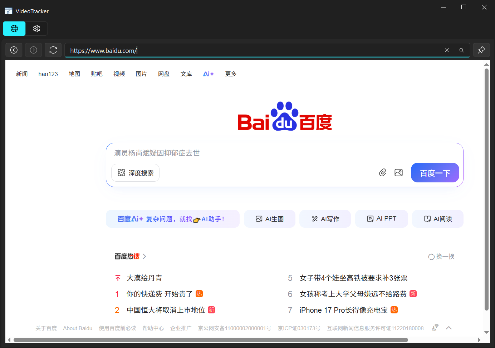
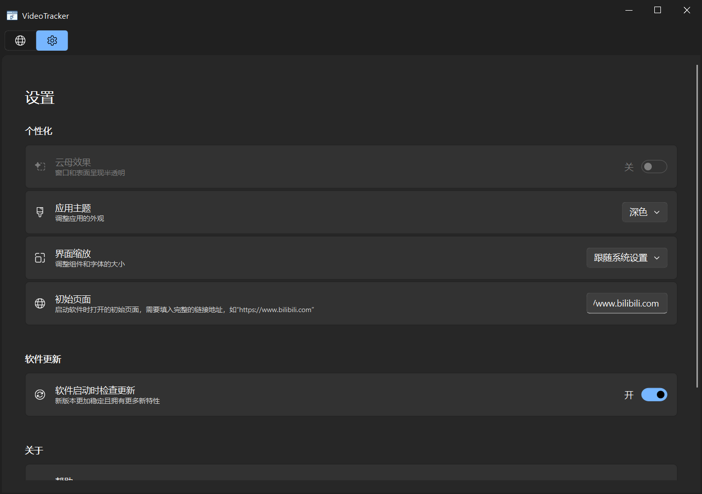

    <h1>
        
         
        VideoTracker
    </h1>
    <h4>置顶小窗，告别切屏</h4>
 

# 功能介绍
**还在为单屏学习/工作时频繁切屏而烦恼？** 尤其当你**跟着教程视频操作**时，是不是总要在浏览器和操作窗口间来回切换？

这款小工具就是你的救星！它能让你`轻松实现“一屏双用”`：

- 🔒 浏览器置顶： 一键将浏览器窗口**钉在最前面**，始终可见。

- 🎮 **全局视频控制 (无需激活窗口)**： 使用全局快捷键，即使浏览器在后台或被遮挡，也能随时控制视频：
  - 暂停 / 播放
  - 快进 (如 +10秒)
  - 快退 (如 -10秒)

**告别这些麻烦**：

- ❌ 频繁在窗口间切换（Alt+Tab 按到手指疼）
- ❌ 为了同时显示而不得不将窗口都缩小化（操作空间局促）
- ❌ 额外购买或连接第二块屏幕

**专注于你的学习和工作流，让单屏效率翻倍！**
# 使用场景
- 跟着视频敲代码
- 跟着视频教程过游戏
- 一切`全屏` + `小窗` 的操作

# 页面展示

👉 点击展开页面 👈

  
  

# 👍赞助

- 微信

