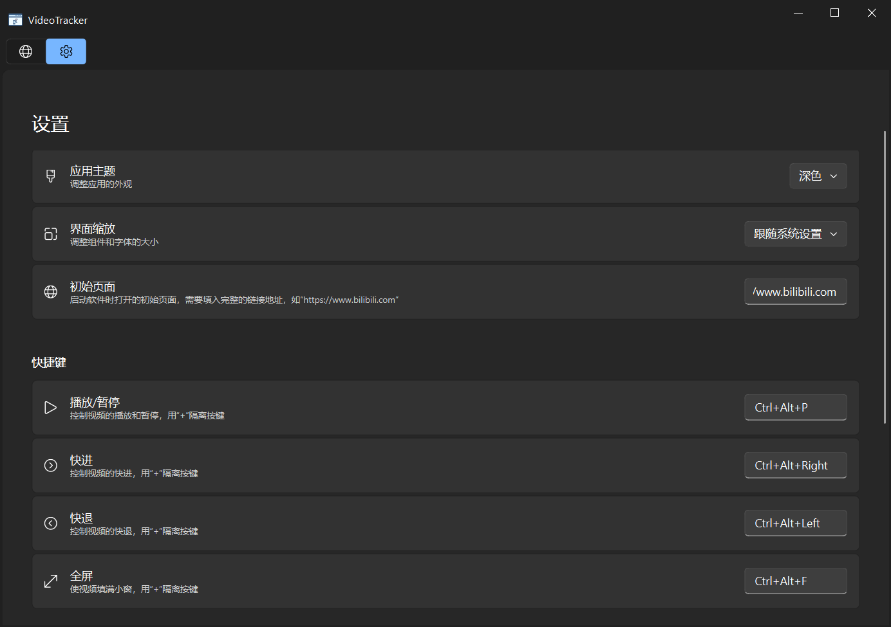

    <h1>
        
         
        VideoTracker
    </h1>
    <h4>置顶小窗，告别切屏</h4>
 

# 功能介绍
当你只有一块屏幕却要看两个窗口，并且有一个窗口是浏览器的时候。没错，就是我在跟教程视频的时候！这个软件能为你提供一种解决方案：将浏览器钉在最前面，这样能使你无需频繁切屏，无需为了同时显示两个窗口而不得不将他们都窗口化，无需额外的屏幕作为拓展。

- 一个浏览器
- 一键置顶窗口
- 全局快捷键无需激活窗口也能控制视频`暂停`,`播放`,`快进`,`快退`
# 使用场景
- 跟着视频敲代码
- 跟着视频教程过游戏
- 一切`全屏` + `小窗` 的操作

# 页面展示

👉 点击展开页面 👈

  
  

# 👍赞助

- 微信

